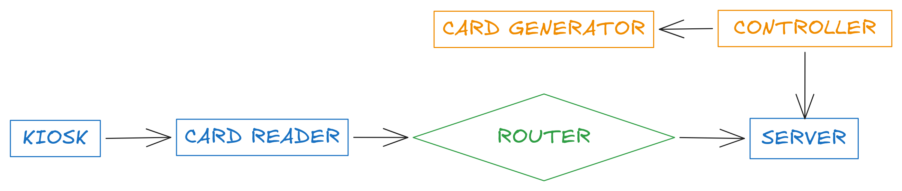

# PUSIT

A simple integrated electronic payment and canteen sales management system using internet of things 

## Architecture

## Hardwares
- GENERATOR
    - ARDUINO NANO
    - W5500 LAN MODULE
    - RFID RC522
- READER
    - ESP32 (any; I utilized WROVER)
    - RFID RC522
- SERVER
    - ORANGE PI ONE H3 (or any; as long as it runs)
    - ROUTER (any; as long as the IoTs can connect)
- KIOSK
    - ANYTHING THAT HAS A BROWSER, AND INPUT & OUTPUT

## NOTE
This project is in beta and it is tested only in a small canteen environment to assess the project effectiveness in improving the efficiency of payment transactions and order processing at canteen settings.
